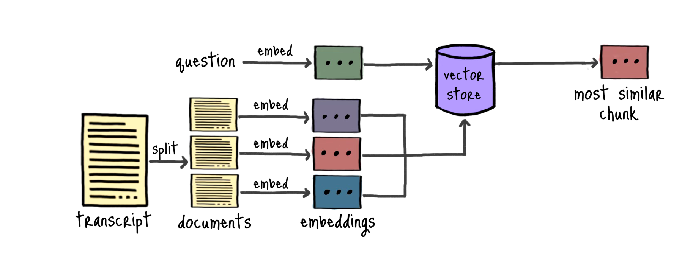
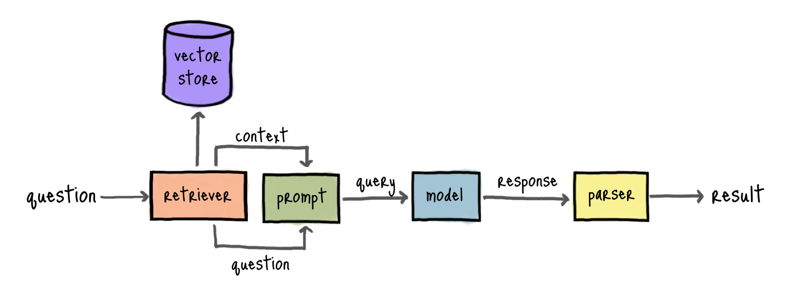

# llm-agents

## Building a RAG for semantic search

General roadmap for the sake of understanding would be

- [ ] First, have semantic search work in a single document
- [ ] Then, see the off-the-shelf available solutions for semantic search
- [ ] Finally, build a semantic search system from scratch

And the end goal

